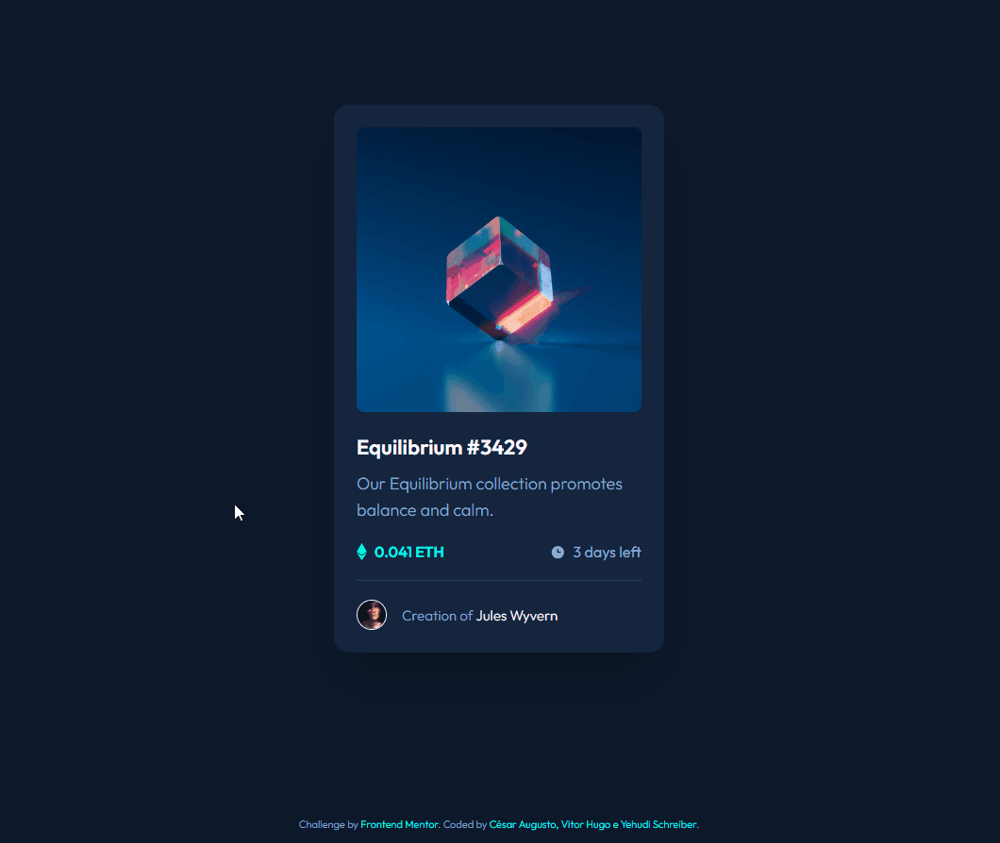

# cardnft.github.io

Esse é um projeto criado por César Augusto, Vitor Hugo e Yehudi Schreiber
seguindo o desafio proposto pelo professor Fábio.

O projeto card nft tem como intuito exercitar as habilidades de trabalho em grupo além de ensinar de forma realista o uso do gihub, nesse caso, utilização de branchs.

Exemplo da página funcionado(inicio)

